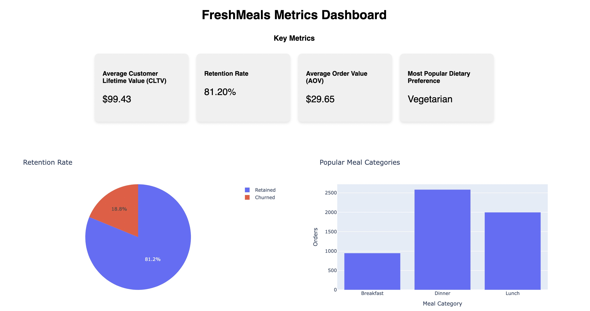
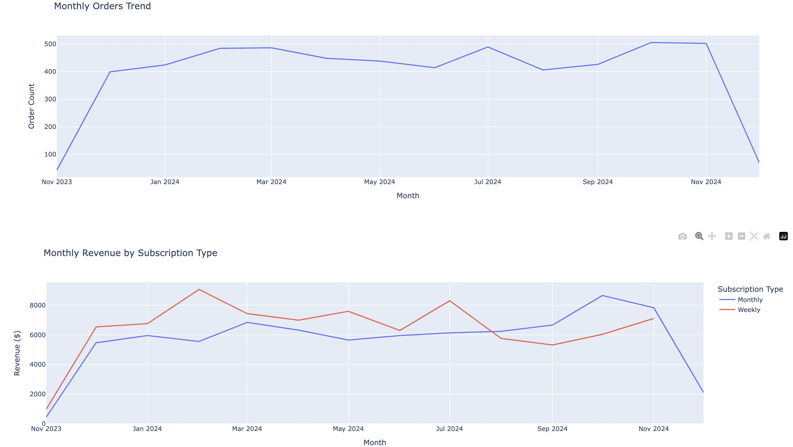

# 📈 FreshMeals Metrics Dashboard 
[Link to web app](https://fresh-meals-metrics-dashboard.onrender.com/)  

This Plotly Dash web app is a dynamic product analytics dashboard designed for a mock meal-based subscription service called FreshMeals. It provides  insights into its key metrics such as customer retention rates, revenue trends, and the popularity of various meal categories. This uses simulated customer data generated with Faker. By visualizing this data through interactive graphs and charts, the app enables the business owners to make informed, data-driven decisions to optimize their offerings and improve customer satisfaction.  


## 🥗 FreshMeals: Product Overview  

FreshMeals is a conceptual meal-based subscription service that is designed to deliver fresh, portioned ingredients with specialty chef recipes directly to cusotmers' doors. With an emphasis on convenience, quality, and healthy eating, FreshMeals caters to busy individuals and families who want to enjoy home-cooked meals without the hassle of grocery shopping or meal planning. It offers a flexible subscription plan, with its clientele being able to choose a weekly or monthly subscription plan.  

**How it works**  
- **Subscription Plans**: Customers select a plan that suits their needs—either **weekly** or **monthly**.  
- **Dietary Preferences**: FreshMeals accommodates a variety of preferences, including **Vegetarian**, **Vegan**, **Keto**, **Gluten-Free**, or **No Preference**.  
- **Personalized Choices**: Customers can customize their experience by picking recipes from a curated menu each week or allowing FreshMeals to surprise them with seasonal favorites. Options are available for **Breakfast**, **Lunch**, and **Dinner**.


## Built with  
- [Dash Plotly](https://dash.plotly.com/)    
- [Faker](https://pypi.org/project/Faker/0.7.4/)  
- [Pandas](https://pandas.pydata.org/)  
- [SQLite](https://www.sqlite.org/)  

## Deployment

This was deployed with [Render](https://render.com/).

## Run Locally  


- Clone this repository  
```
git clone https://github.com/lixjiajia/product_dashboard.git 
```  
- Create and activate a new virtual environment:  
```
python -m venv freshmeals
source freshmeals/bin/activate
```  
- Install dependencies  
```
pip install -r requirements.txt
```
- Run the app!  
```
python app.py
``` 